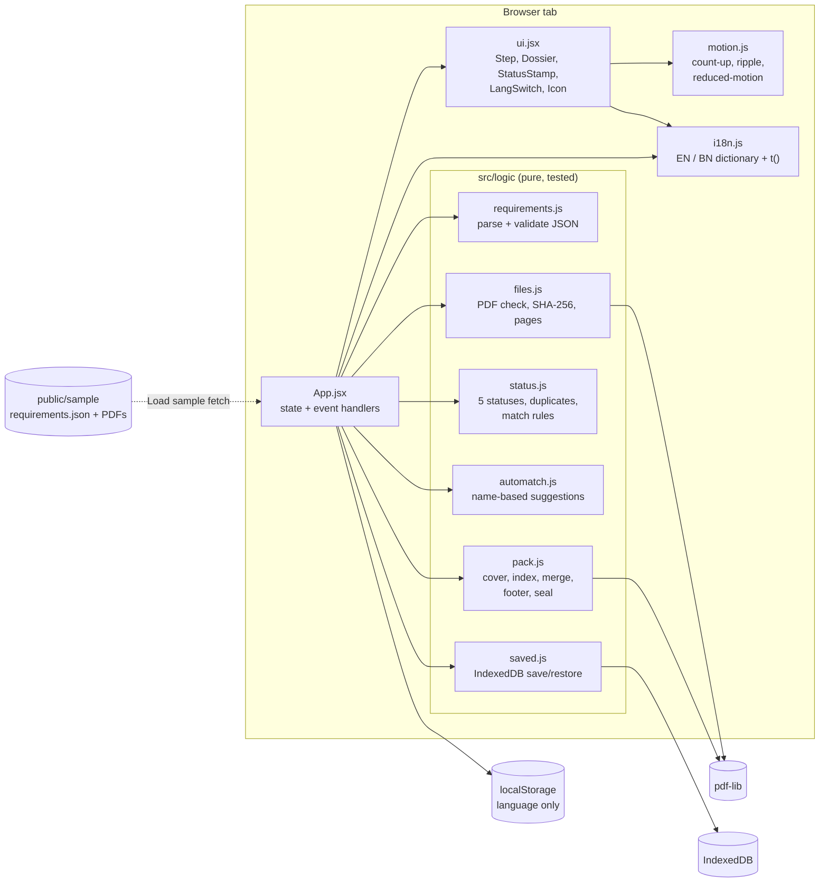
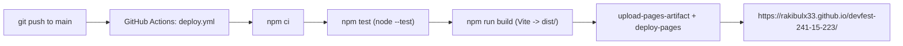

# Architecture

How the Tender Package Builder is put together, how the parts talk to each other, and what happens in the
background during a normal session.

- [1. Big picture](#1-big-picture)
- [2. Module map](#2-module-map)
- [3. State model](#3-state-model)
- [4. What happens in the background (walk-through)](#4-what-happens-in-the-background-walk-through)
- [5. The rules engine](#5-the-rules-engine)
- [6. The PDF builder](#6-the-pdf-builder)
- [7. Persistence, language and storage](#7-persistence-language-and-storage)
- [8. UI, design system and motion](#8-ui-design-system-and-motion)
- [9. Build, test and deploy pipeline](#9-build-test-and-deploy-pipeline)
- [10. Security model](#10-security-model)
- [11. Design decisions and trade-offs](#11-design-decisions-and-trade-offs)
- [12. How to extend](#12-how-to-extend)

## 1. Big picture

The app is a **single-page, frontend-only** web app (Vite + React, plain JavaScript). There is no server, no
database and no network call for user data: every PDF is read, checked and merged **inside the browser tab**.

Two layers, kept strictly apart:

| Layer | Where | Rule |
|---|---|---|
| **Logic** — pure functions: parse, validate, status rules, duplicate detection, PDF building | `src/logic/*.js` | No React, no DOM (except where noted), unit-tested with `node --test` |
| **UI** — state, rendering, animation, translations | `src/App.jsx`, `src/ui.jsx`, `src/motion.js`, `src/i18n.js`, `src/App.css` | Calls the logic layer; owns all state |



Data only ever moves **into** the page (user files, the bundled sample) and **out** as a downloaded PDF/CSV. The
only external request is the Google Fonts stylesheet/fonts (cosmetic; the app works without them).

## 2. Module map

```
index.html                 Entry page: CSP + referrer meta tags, Google Fonts link, <div id="root">
vite.config.js             base: './' so the build works from any sub-path (GitHub Pages)
src/main.jsx               Mounts <App/> in React StrictMode
src/App.jsx                The whole application state + all event handlers + page layout
src/ui.jsx                 Presentational components: Icon, BrandMark, Step, StatusStamp, LangSwitch, Dossier
src/motion.js              reducedMotion(), useCountUp(), useRipple()
src/i18n.js                { en, bn } dictionaries and t(lang, key, vars)
src/App.css                Design tokens (:root), layout, components, motion layer, responsive rules
src/logic/requirements.js  parseRequirements(text) -> { tender, requirements } | { errors }
src/logic/files.js         inspectPdf(bytes) -> { hash, pages } | { hash, error }
src/logic/status.js        statusOf, allStatuses, duplicateIds, matchBlocker, BLOCKING
src/logic/automatch.js     scoreName, suggestMatches
src/logic/pack.js          buildPackage, parsePageList, needsImage, latin, footerText
src/logic/saved.js         loadProject / saveProject / clearProject (IndexedDB)
public/sample/             Organizer sample pack (requirements.json + documents/), served as static files
public/favicon.svg         Brand icon
tests/logic.test.js        14 node:test checks (see section 9)
.github/workflows/         deploy.yml: test -> build -> deploy to GitHub Pages
output/                    T-2026-0417_Package.pdf generated from the sample pack
screenshots/               Evidence screenshots (statuses in English and Bangla, ready state, mobile, ...)
docs/                      This documentation
```

### Who calls whom

| Module | Called by | Calls |
|---|---|---|
| `App.jsx` | `main.jsx` | every logic module, `ui.jsx`, `motion.js`, `i18n.js` |
| `ui.jsx` | `App.jsx` | `motion.js` (`useCountUp`) |
| `requirements.js` | `App.jsx` | – |
| `files.js` | `App.jsx` | `pdf-lib`, Web Crypto (`crypto.subtle`) |
| `status.js` | `App.jsx`, `automatch.js` | `requirements.js` (`isIsoDate`) |
| `automatch.js` | `App.jsx` | `status.js` (`matchBlocker`) |
| `pack.js` | `App.jsx` | `pdf-lib` |
| `saved.js` | `App.jsx` | `indexedDB` |

## 3. State model

All state lives in `App.jsx` (React `useState`); there is no global store. Components in `ui.jsx` receive plain
values and callbacks.

| State | Shape | Meaning |
|---|---|---|
| `req` | `{ tender, requirements[] }` or `null` | Parsed tender, requirements sorted by `order` |
| `reqErrors` | `[{ code, field, … }]` | Validation problems of the last opened JSON |
| `files` | `[{ id, name, size, hash, pages, bytes, error? }]` | Every uploaded file (rejected ones carry `error`) |
| `matches` | `{ [requirementId]: fileId }` | The user's matching (1 file ↔ 1 requirement) |
| `expiry` | `{ [requirementId]: 'YYYY-MM-DD' }` | Entered expiry dates |
| `withIndex`, `seal`, `sealMode`, `sealPages`, `sealPos` | options | Index page and seal/signature settings |
| `gen` | `{ state: idle\|busy\|done\|error, url, pages, msg }` | Result of the last *Generate* |
| `lang` | `'en' \| 'bn'` | UI language |
| `loaded`, `restored` | booleans | IndexedDB restore bookkeeping |
| `flash`, `leaving`, `swap`, `shaking`, `dragOver`, `reading`, `notice` | UI-only | Transient animation / feedback flags |

**Derived values** (computed with `useMemo`, never stored): `dups` (duplicate file ids), `fileById`, `rows`
(requirement + status), `blocking` (rows whose status blocks the package), `included` (rows with a file),
`totalPages`, `sealPageList`, `sealInvalid`, `canGenerate`, and the step-done flags. Because statuses are
**derived** from `matches` + `expiry` + deadline on every render, they update instantly after any change — there
is no "check" button and no stale status.

Any edit that could change the package (`resetGen()`) clears the previous *Generate* result, so the "Generated"
stamp and download link never describe an outdated package.

## 4. What happens in the background (walk-through)

### 4.1 Opening `requirements.json`
1. `FileReader`/`file.text()` reads the file; `parseRequirements(text)` runs `JSON.parse` inside `try/catch`.
2. It validates the `tender` object (all five fields present, `submission_deadline` a **real** `YYYY-MM-DD` date)
   and every requirement (unique `id`, numeric `order`, at least one title, boolean `mandatory`/`has_expiry`).
3. On errors it returns codes such as `{ code: 'bad_deadline', field: 'tender.submission_deadline' }`; the UI
   translates them with `t(lang, 'rq_bad_deadline', …)` — so the message is bilingual and never crashes the app.
4. On success the requirements are normalised (a missing title falls back to the other language, `"3"` becomes
   `3`) and sorted by `order` (ties by `id`).

### 4.2 Uploading files
For each selected file (`addFiles` in `App.jsx`), in order:
1. Limits: more than 30 valid files → `too_many`; more than 50 MB total → `too_big`.
2. `file.arrayBuffer()` → `Uint8Array`.
3. `inspectPdf(bytes)` (`files.js`):
   - SHA-256 of the bytes via `crypto.subtle.digest` → the **content hash** (used for duplicates);
   - `looksLikePdf`: the `%PDF-` marker must appear in the first 1 KB — a `.png` renamed `.pdf` is still
     rejected (`not_pdf`), and a real PDF with a wrong extension is accepted;
   - `PDFDocument.load(bytes)` from pdf-lib → page count; an exception mentioning *encrypt* →
     `encrypted`, any other failure or 0 pages → `damaged`.
4. The file is appended to `files` (rejected files stay in the list with a red message so the user sees why).

### 4.3 Matching and statuses
- The file picker of each row is a `<select>`. Options that would break a rule are **disabled** and labelled,
  using `matchBlocker(reqId, fileId, matches, files)`:
  - `used` — the file is already matched to another document (one file → at most one document);
  - `duplicate` — an identical-content file is already matched to a different document;
  - `invalid` — the file was rejected.
  (One document → at most one file is automatic: the select holds a single value.)
- Changing or clearing a match deletes the date entered for the old file (it belonged to that file).
- `allStatuses()` maps every requirement to exactly one status (see section 5). The package panel counts them,
  draws one coloured segment each, and lists the blocking ones.

### 4.4 Generate
```mermaid
sequenceDiagram
  participant U as User
  participant A as App.jsx
  participant P as pack.js
  participant L as pdf-lib
  U->>A: click "Generate package PDF"
  A->>A: tryGenerate(): blocked? shake + jump to first problem
  A->>A: bnPng(title_bn) per document (canvas -> PNG) if index is on
  A->>A: bnPng(tender text) for cover fields that are not Latin
  A->>P: buildPackage({ tender, docs, generatedDate, withIndex, seal, textImages })
  P->>L: load every source PDF, count pages, compute start pages
  P->>L: draw cover (+ index), copy pages, add footer strip, stamp seal
  L-->>P: bytes
  P-->>A: Uint8Array
  A->>A: Blob -> object URL -> hidden <a download="<tender_id>_Package.pdf">.click()
  A-->>U: browser downloads the file; "Generated" stamp + link shown
```
`tryGenerate()` is attached to an `aria-disabled` button (not a native `disabled` one) so a click while blocked
is still received: it shakes the package panel and scrolls to the first problem instead of doing nothing.

## 5. The rules engine

`src/logic/status.js` — the heart of the judging criteria (Problem Statement §5).

```
statusOf(requirement, hasFile, expiryDate, deadline):
  no file         -> mandatory ? 'missing' : 'not_provided'
  has_expiry:
      date is not a valid YYYY-MM-DD   -> 'expiry_needed'
      date <  deadline                 -> 'expired'          (string compare is safe: ISO dates)
  otherwise                            -> 'ok'               (date == deadline is still OK)
```

| Status | Blocks the package? |
|---|---|
| `missing`, `expiry_needed`, `expired` | **Yes** (`BLOCKING` set) |
| `not_provided`, `ok` | No |

An optional document with `has_expiry` that *is* matched and expired shows **Expired** and blocks (the status
table says Expired blocks; the app does not special-case optional documents).

**Duplicates** (`duplicateIds`): valid files grouped by SHA-256; every file whose hash occurs more than once is
marked, whatever its name. **Auto-match** (`automatch.js`): words of the file name (≥ 3 letters, e.g.
`bank_solvency.pdf` → `bank`, `solvency`) are compared by prefix with the words of `title_en`; generic words
(`certificate`, `cert`, `letter`, `document`, …) count half and can never justify a match alone; when two
files with *different content* tie for one document (e.g. `trade_license_2025` vs `_2026`) nothing is suggested
and the user decides.

## 6. The PDF builder

`src/logic/pack.js` → `buildPackage()` returns a `Uint8Array`. Steps:

1. **Load** every source PDF with pdf-lib and read its page count.
2. **Page numbering** — `front` = 1 (cover) or 2 (cover + index); `total = front + Σ pages`; the start page of
   document *i* is `front + 1 + Σ pages before it`.
3. **Cover (page 1, A4, English)** — tender ID, title, procuring entity, bidder, deadline, generation date, and
   the list of included documents in order with page counts. Text uses the built-in Helvetica (WinAnsi); a field
   with characters Helvetica cannot draw (e.g. Bangla) is drawn from a PNG that the browser renders from its own
   text engine (`needsImage()` / `textImages`).
4. **Index (optional)** — document titles with start pages; Bangla titles are PNGs rendered by `bnPng()` in
   `App.jsx` (canvas + Noto Sans Bengali), because pdf-lib cannot shape Bangla conjuncts.
5. **Documents** — `copyPages` keeps **all pages in their original order**, documents in requirement order;
   optional documents without a file are simply absent.
6. **Footer `<tender_id> | Page X of Y`** on *every* page (Y is known because step 2 ran first):
   - cover and index: a white strip + hairline + centred text at the bottom of the A4 page;
   - document pages: the page's MediaBox/CropBox is **extended 28 pt downward** and the footer is drawn in that
     new strip. Original content is never touched or overlapped (Problem Statement §6.4). Works for any page
     size, offset boxes and cropped pages;
   - **rotated pages** (90/180/270): the page is embedded and redrawn upright on a new page with the same strip,
     so "bottom" is the visual bottom.
7. **Seal/signature (optional)** — a PNG (110 pt wide) is drawn at the left/right margin just above the footer on
   the chosen package pages.
8. `setTitle("<tender_id> Package")`, `save()`.

## 7. Persistence, language and storage

| Data | Where | Why |
|---|---|---|
| Whole project (`req`, `files` incl. bytes, `matches`, `expiry`, `withIndex`) | **IndexedDB** `tender-package-builder` / store `kv` / key `project` (`saved.js`) | Survive a reload; files are binary and too big for localStorage |
| Language (`en`/`bn`) | **localStorage** key `lang` | Remembered choice (rule: toggle in header, remembered) |
| Seal image, transient flags | memory only | Not needed after reload |

Saving starts only after the first restore attempt finished (`loaded`), so an empty state can never overwrite a
saved project. Every storage call is wrapped in `try/catch`: if storage is blocked (private window) the app
works normally, just without saving. **Start over** calls `clearProject()`.

**i18n** (`i18n.js`): two dictionaries with identical keys; `t(lang, key, vars)` replaces `{name}` placeholders and
falls back to English, then to the key itself. Key families: `st_*` statuses, `hint_*` status hints, `err_*` file
rejections, `rq_*` requirement-file errors, `seal_*` seal options. Dataset text (tender fields, file names, the
requirement titles) is shown as given. The document `lang` attribute and `<title>` follow the switch.

## 8. UI, design system and motion

- **Layout** — a two-column workspace (steps on the left, sticky "package panel" on the right) that becomes a
  single column with a fixed bottom bar at ≤ 960 px; the requirement table turns into stacked cards at ≤ 720 px.
  Verified at 375 px with no horizontal scroll.
- **Tokens** — all colours, radii, shadows and easing curves are CSS variables on `:root` in `App.css` (bottle
  green brand, paper background, stamp-red / amber / blue for status). Fonts: Public Sans + Noto Sans Bengali.
- **Accessibility** — status is always icon + text + colour; visible focus ring; 44 px touch targets; labels on
  every control; `aria-disabled` generate button with `aria-describedby` → reasons list; polite live regions;
  `prefers-reduced-motion` disables animations (the count-up and ripple check it in JS too).
- **Motion** (all transform/opacity, 150–600 ms): status "stamp" on change, staggered row/file entrance, rail
  fill and dot pop on step completion, count-up page counter, shake + jump when Generate is pressed while blocked,
  slam-in "Generated" stamp, button lift/press/sheen/ripple, sliding language pill. Scroll-driven effects
  (`animation-timeline`) are feature-guarded with `@supports`.

## 9. Build, test and deploy pipeline



- **Tests** (`tests/logic.test.js`, 14 checks, run with `node --test`): requirement parsing and sorting, validation
  errors, status table incl. same-day expiry, file inspection (non-PDF, duplicates, page counts, damaged,
  encrypted), matching rules, the sample package (page count, order, footers via `pdftotext` when available),
  rotated pages, auto-match, page-list parsing, seal placement, WinAnsi/Bangla cover handling, lenient parsing.
- **Build** — `vite build`; `base: './'` keeps asset paths relative so the site works under
  `/devfest-241-15-223/`.
- **Deploy** — the workflow fails (and nothing is published) if tests or the build fail.

## 10. Security model

- No backend and no data upload; the only third-party request is Google Fonts.
- A `Content-Security-Policy` meta tag (`default-src 'none'`, scripts only from the site itself, fonts/styles from
  Google Fonts, images from self/`data:`/`blob:`, no `object`/`form`/`base`) plus `referrer: no-referrer`.
- User input is data, never code: React escapes all text; no `innerHTML`, `eval` or dynamic script loading.
  Files are identified by content (`%PDF-`), parsed by pdf-lib in the page, never executed.
- CSV export prefixes cells that start with `=`, `+`, `-`, `@` with `'` (spreadsheet formula injection).
- No keys, tokens or secrets anywhere in code or history; `npm audit` reports 0 vulnerabilities.

## 11. Design decisions and trade-offs

| Decision | Why | Cost |
|---|---|---|
| Statuses are derived, not stored | Always consistent, instant updates | Recomputed per render (10–30 rows: negligible) |
| Footer in an *added* strip | Guarantees the footer never covers content for any page geometry | Document pages become 28 pt taller |
| Hash-based duplicate detection | Same bytes with different names are caught | Re-saved but visually identical PDFs are not duplicates |
| Bangla via browser-rendered PNG | pdf-lib cannot shape Bangla; no font embedding/shaping library needed | Bangla text in the PDF is an image (not selectable) |
| Rotated pages re-embedded | Footer at the visual bottom | Links/form fields on those pages are lost |
| Everything in memory, sequential | Simple and predictable for ≤ 30 files / 50 MB | Very large packages need RAM |
| IndexedDB for persistence | Binary-safe, no size worry | Saved per browser, not synced |

## 12. How to extend

- **New language** — copy the `en` block in `i18n.js` to a new key (e.g. `hi`), translate it, add a button to
  `LangSwitch` in `ui.jsx` and allow the code in `App.jsx` (`store.get('lang')`).
- **New status or rule** — change `statusOf` in `status.js`, add `st_<status>` / `hint_<status>` strings, a colour
  rule (`.s-<status>`, `.seg-<status>`, `.row-<status>`) and a case in `STATUS_ICON`; add a test.
- **New field in `requirements.json`** — validate it in `requirements.js` (add an `rq_*` message), use it in
  `App.jsx` / `pack.js`.
- **Change the footer** — `footerText()` and `drawFooter()` in `pack.js` (`STRIP` is the strip height).
